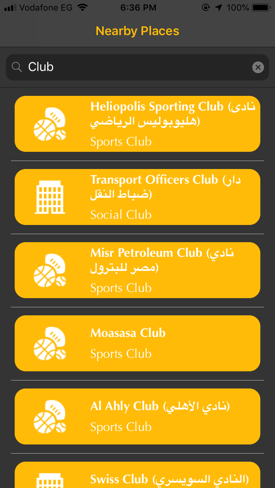
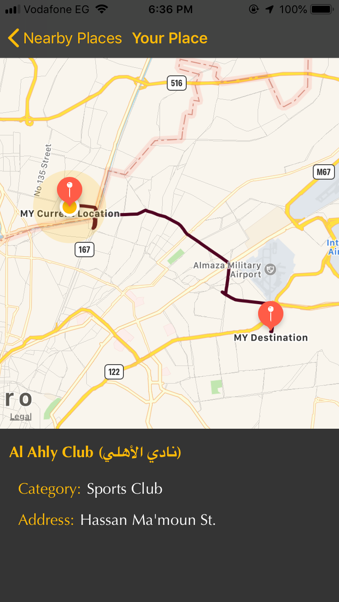

# Nearby-Places
allow the user to know the places near to him depend on his current location and show details about the place he wants to go and draw the route path from current position to the other destination.

<h1>Logo</h1>

<h1>list of any places you search about it</h1>

<h1>on click on a selected place</h1>

